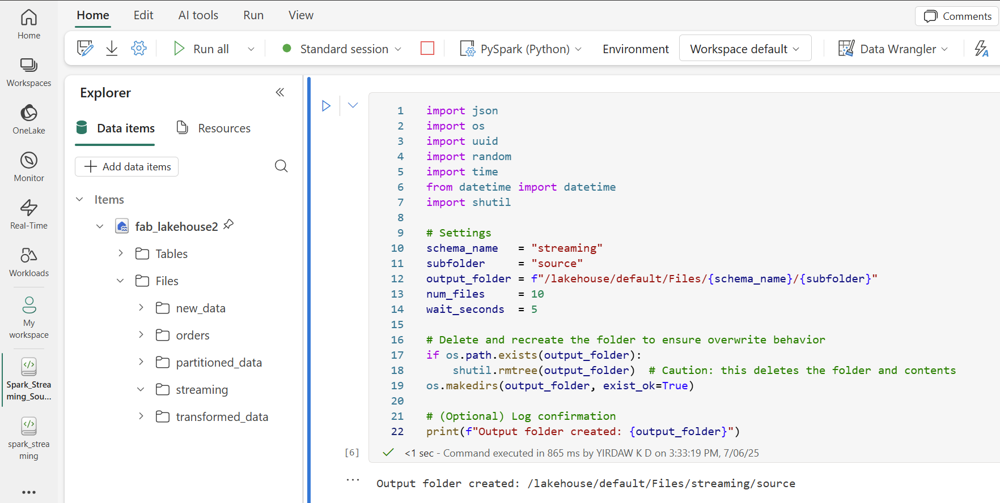
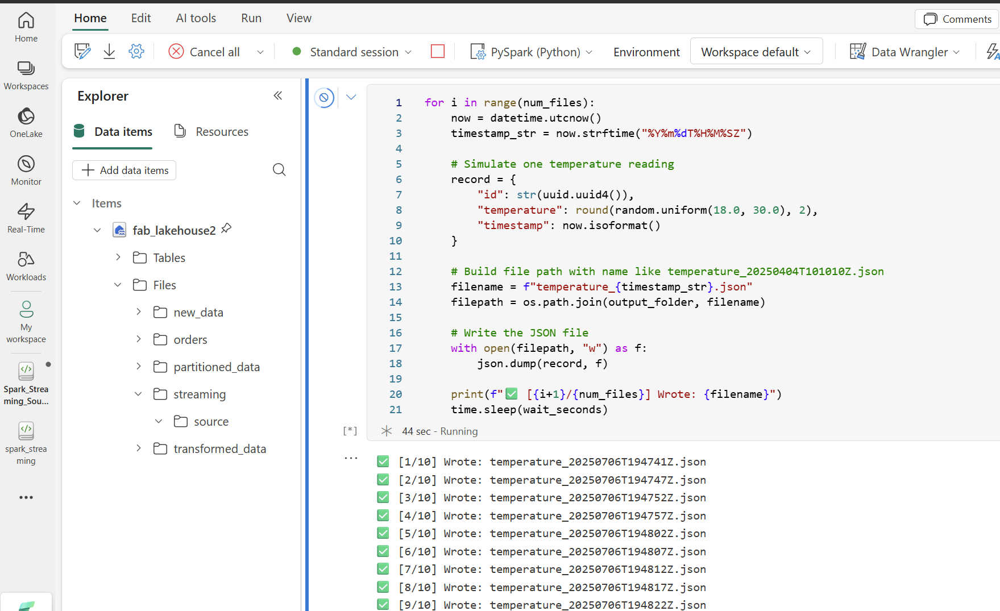
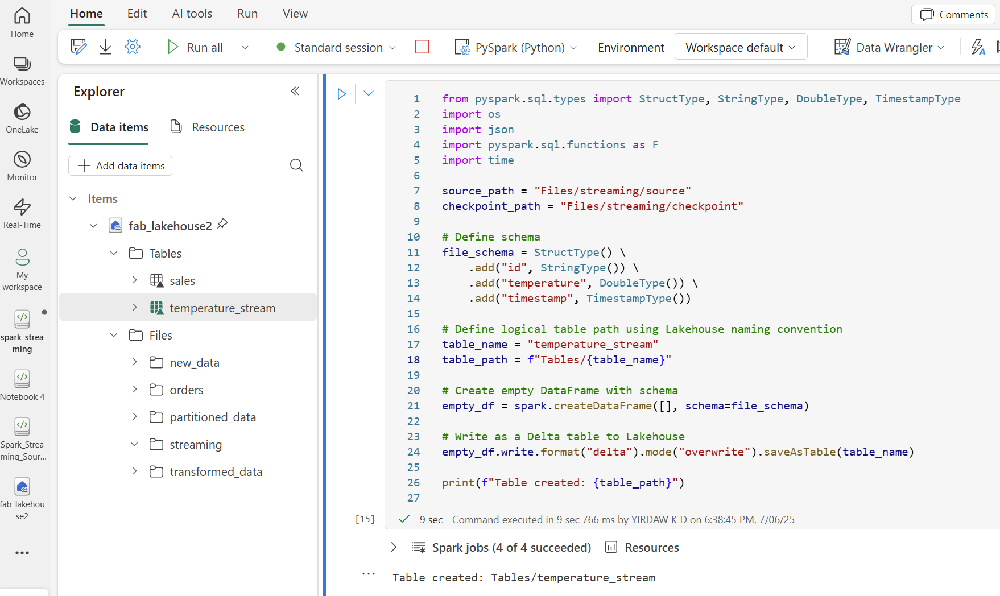
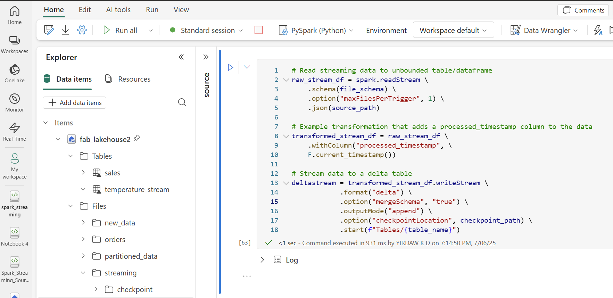
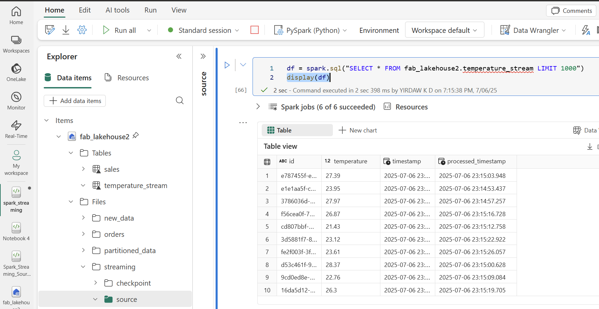
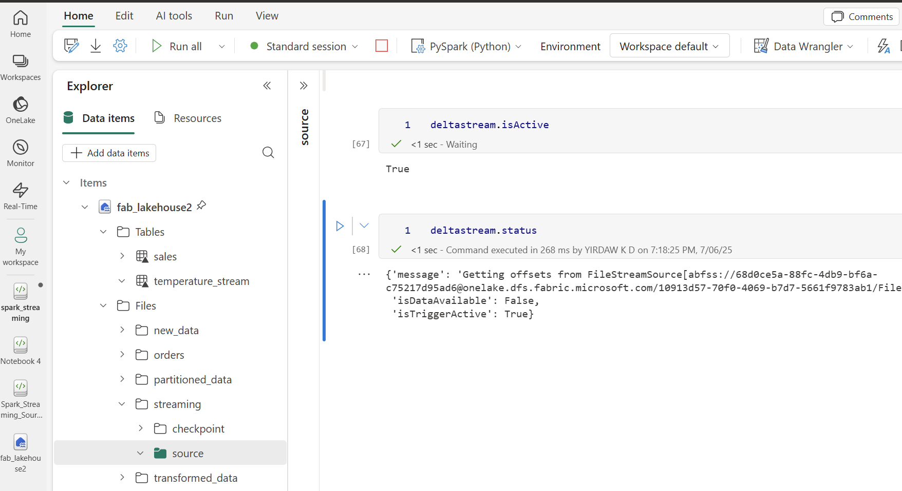

# streaming-spark

## Simulating data streaming with Spark

## Step 1: Creating Schema and Folder in lakehouse

## Step 2: Generating temperature data in the source folder

## Step 3: Setting-up Destination Schema and Table

## Step 4: Streaming Data from Source to Destination

## Step 5: Examining Streamed Data

## Step 6: Verifiying if stream remains open
